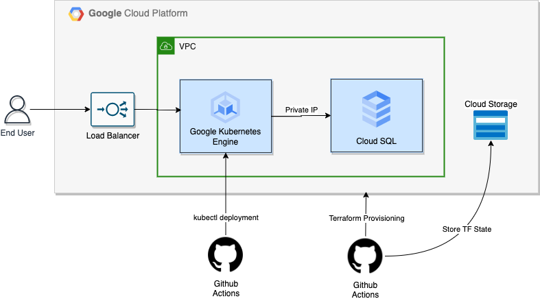

# Servian Tech Challenge Solution

The given Golang application has been deployed to Google Cloud Platform. The application is deployed as a containerised application using Google Kubernetes Engine. The application is deployed in a GKE cluster with a single node per zone. The application is exposed to the internet using a load balancer.

## Pre-requisites

*Google Cloud Project*

A google cloud project needs to be created and the project id needs to be captured. See [here](https://cloud.google.com/resource-manager/docs/creating-managing-projects) for more information.

*Google Cloud Service Account*

A service account needs to be created and the service account key needs to be downloaded. See [here](https://cloud.google.com/iam/docs/creating-managing-service-accounts) for more information. The service account should have necessary permissions to create GCP resources.

*Cloud Storage Bucket*

A cloud storage bucket needs to be created. See [here](https://cloud.google.com/storage/docs/creating-buckets) for more information. This will be used to store the terraform state. The storage bucket name should be `terraform-state-servian-tech-challenge`. 

## Solution Architecture

The solution architecture is shown below.

### Security

Cloud SQL has been accessed through private IP instead of public IP. This avoids traffic to go through the internet. This is achived using [Cloud SQL Private IP](https://cloud.google.com/sql/docs/mysql/private-ip) feature.

### Resiliency

Multiple GKE worker nodes are added for high availability. GKE cluster worker nodes are span across multiple zones to provide higher resiliency. 

## Instructions

Infrastructure provisioning and application deployment is automated using Github Actions. Following secrets need to be setup in the github repository for the `infra-provisioning` workflow to run successfully.

> **Note**: User need `admin` access to the repository to setup the secrets. Or user can clone the repository and provide below secrets to run the github workflow.

### Secrets for `infra-provisioning` workflow,

* `GOOGLE_APPLICATION_CREDENTIALS` - GCP Service Account credentials in base64 format.
* `DB_USER` - Cloud SQL DB user. Terraform use this while creating the SQL instance.
* `DB_PASSWORD` - Decide a strong password for the database. Terraform use this while creating the SQL instance.

### Secrets for `app-deployment` workflow to run successfully.

* `GCP_PROJECT_ID` - GCP Project ID.
* `DB_HOST_BASE64` - Database Host in base64 format.
* `DB_USER_BASE64` - Database user in base64 format.
* `DB_PASSWORD_BASE64` - Decide a strong password for the database.
* `GKE_CLUSTER_NAME` - GKE Cluster Name.
* `GKE_CLUSTER_LOCATION` - GKE cluster location. (eg: us-central1)

Github workflows automatically run whenever there is a change in corresponding folder. For example, `infra-provisioning` workflow runs whenever there is a change in `terraform` folder. And `app-deployment` workflow runs whenever there is a change in `kubernetes` folder. Manual trigger can be done by clicking on the `Run workflow` button in the Actions tab.

### Steps to deploy and run the application,

* Update `Infra Provisioning` workflow with the required secrets.
* Trigger `Infra Provisioning` workflow.
* Validate the terraform plan.
* Trigger `Infra Provisioning` workflow again with `terraform_apply` flag ON to apply the changes.
* Update `App Deployment` workflow with the required secrets.
* Trigger `App Deployment` workflow with `initialize-db` flag ON to seed the data.
* Application's external IP address can be found in the `App Deployment` workflow logs.
* Access the external IP address in the browser to access the application.
